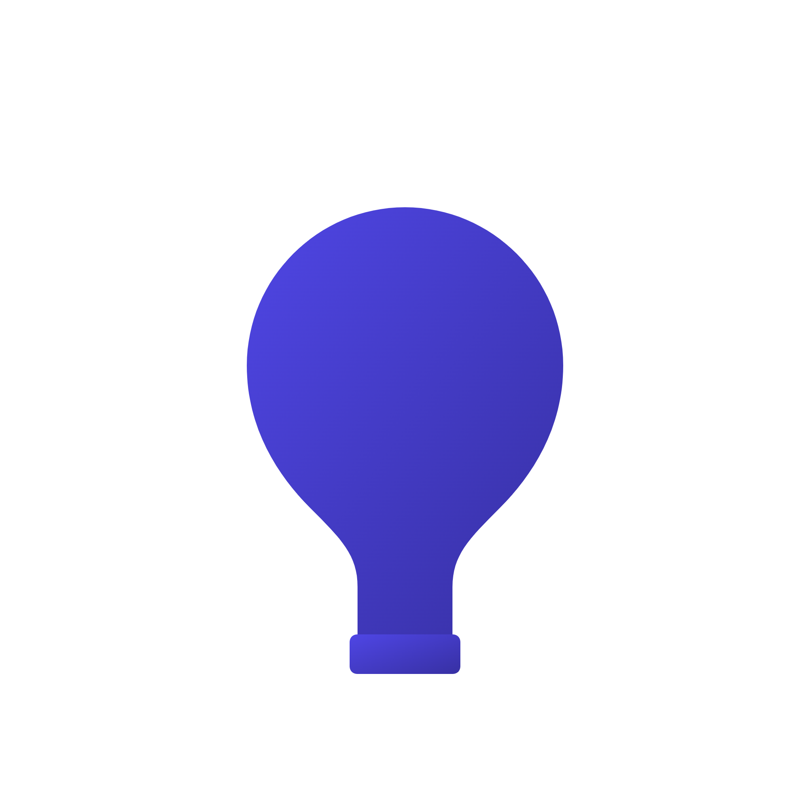

  

<h1 align="center">NoSleep</h1>

  一个简单的 macOS 工具，用于防止系统自动休眠

## 简介

NoSleep 是一个轻量级的 macOS 状态栏应用，它可以：
- 防止系统自动休眠
- 保持显示器常亮
- 支持 Intel 和 Apple Silicon Mac
- 简单易用的开关控制

## 下载

从 [Releases](https://github.com/c-zeong/NoSleep/releases) 页面下载最新版本。

## 系统要求

- macOS 10.13 或更高版本
- 支持 Intel 和 Apple Silicon Mac

## 开发者

[@c-zeong](https://github.com/c-zeong) 